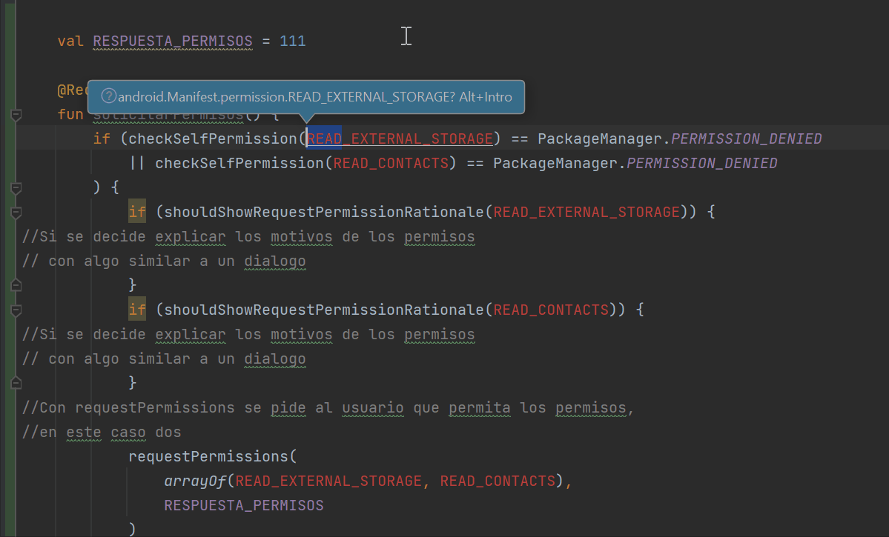

# Jetbrains

## [volver](../../Shortcuts.md)

| Acción                           | Comando         |
| ---------------------------------|:---------------:|
| Buscar (Todo)                    | SHIFT x2        |
| Comentarios .kt                  | // & /**/       |
| Comentarios .xml                 | \<!-- --\>        |
| Deshacer                         | CTRL + Z        |
| Duplicar Línea                   | CTRL + D        |
| Ejecutar                         | SHIFT + F10     |
| Formatear Código                 | CTRL + ALT + L  |   
| Reemplazar	                   | CTRL + R        |
| Rehacer                          | CTRL + SHIFT + Z|
| Seleccionar siguiente coincidencia| ALT + J|
| [Encontrar todas las ocurrencias](#find-next-word)   | CTRL + ALT + SHIFT + J|

### [Encontrar todas las ocurrencias](https://www.jetbrains.com/idea/guide/tips/find-next-word/#:~:text=Press%20%E2%8C%98G%20(macOS)%2C,occurrences%20of%20the%20same%20word.)  

