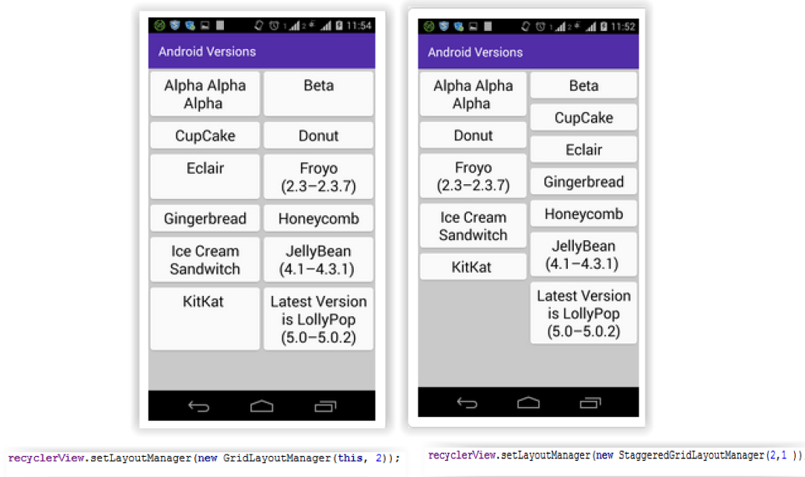

<style>
o { color: Orange }
b { color: Blue }
</style>

# RecyclerView (Tema8 p4)
- [RecyclerView (Tema8 p4)](#recyclerview-tema8-p4)
  - [1. Crear una clase <b>pojo con constructor</b> *Ej. Usuario.kt*](#1-crear-una-clase-bpojo-con-constructorb-ej-usuariokt)
  - [2. <b>Añadir el RecyclerView al layout</b> que se va a mostrar *Ej. main_activity.xml*](#2-bañadir-el-recyclerview-al-layoutb-que-se-va-a-mostrar-ej-main_activityxml)
  - [3. Crear un layout generico para las vistas de los elementos del recycler *Ej. recyclerlayout.xml*](#3-crear-un-layout-generico-para-las-vistas-de-los-elementos-del-recycler-ej-recyclerlayoutxml)
  - [4. Crear una <b>clase Holder.kt que reciba una vista y herede de RecylclerView.ViewHolder</b> * Ej. Holder.kt*](#4-crear-una-bclase-holderkt-que-reciba-una-vista-y-herede-de-recylclerviewviewholderb--ej-holderkt)
  - [5. Creamos una clase que herede de RecyclerView.Adapter nos obliga a sobreescribir 3 metodos *Ej. Adaptor*](#5-creamos-una-clase-que-herede-de-recyclerviewadapter-nos-obliga-a-sobreescribir-3-metodos-ej-adaptor)
  - [6. <b>Asignar el adaptador al ReciclerView</b> en nuestra MainActivity](#6-basignar-el-adaptador-al-reciclerviewb-en-nuestra-mainactivity)
- [Otras propiedades (Tema8 p11)](#otras-propiedades-tema8-p11)
  - [tipos de LayoutManager](#tipos-de-layoutmanager)
  - [ItemDecoration e ItemAnimation](#itemdecoration-e-itemanimation)
- [Mas RecyclerView](#mas-recyclerview)
  - [7. Click sobre un elemento de la lista](#7-click-sobre-un-elemento-de-la-lista)
    - [8. Llamar al metodo desde donde queramos utilizarlo Ej. MainActivity](#8-llamar-al-metodo-desde-donde-queramos-utilizarlo-ej-mainactivity)
  - [Click en cualquier lugar de la vista](#click-en-cualquier-lugar-de-la-vista)
    - [Incluir en el recyclerlayout el elemento sobre el que se va a hacer click Ej. una imagen](#incluir-en-el-recyclerlayout-el-elemento-sobre-el-que-se-va-a-hacer-click-ej-una-imagen)
    - [añadimos el codigo al holder](#añadimos-el-codigo-al-holder)
  - [Click en cualquier lugar de la vista pasando informacion a la Actividad principal mediante interface](#click-en-cualquier-lugar-de-la-vista-pasando-informacion-a-la-actividad-principal-mediante-interface)
## 1. Crear una clase <b>pojo con constructor</b> *Ej. Usuario.kt*

```kt
class Usuario(nombre:String apellidos:String) {
    var nombre: String
    var apellidos: String
    init {
        this.nombre = nombre
        this.apellidos = apellidos
    }
}
```

## 2. <b>Añadir el RecyclerView al layout</b> que se va a mostrar *Ej. main_activity.xml*

```xml
<androidx.constraintlayout.widget.ConstraintLayout
    xmlns:android="http://schemas.android.com/apk/res/android"
    xmlns:tools="http://schemas.android.com/tools"
    android:layout_width="match_parent"
    android:layout_height="match_parent"
    tools:context=".MainActivity">
<androidx.recyclerview.widget.RecyclerView
    android:id="@+id/recyclerList"
    android:background="@color/azul"
    android:layout_width="match_parent"
    android:layout_height="match_parent"/>
</androidx.constraintlayout.widget.ConstraintLayout>
```

## 3. Crear un layout generico para las vistas de los elementos del recycler *Ej. recyclerlayout.xml*

```xml
<?xml version="1.0" encoding="utf-8"?>
<androidx.cardview.widget.CardView
    xmlns:android="http://schemas.android.com/apk/res/android"
    xmlns:card_view="http://schemas.android.com/apk/res-auto"
    android:layout_width="match_parent"
    android:layout_height="wrap_content"
    card_view:cardCornerRadius="4dp"
    card_view:cardUseCompatPadding="true"
    card_view:cardElevation="2dp">
    <LinearLayout
        android:padding="8dp"
        android:background="#493DEC"
        android:layout_width="match_parent"
        android:layout_height="match_parent"
        android:gravity="center"
        android:orientation="horizontal">
        <LinearLayout
            android:layout_width="0dp"
            android:layout_height="wrap_content"
            android:layout_weight="0.75"
            android:orientation="vertical">
            <TextView
                android:id="@+id/textView"
                android:layout_width="wrap_content"
                android:layout_height="wrap_content"
                android:text="Large Text"
                android:textColor="@android:color/white"
                android:textSize="20sp" />
            <TextView
                android:id="@+id/textView2"
                android:layout_width="wrap_content"
                android:layout_height="wrap_content"
                android:text="Medium Text"
                android:textColor="@android:color/white"
                android:textSize="15sp" />
        </LinearLayout>
    </LinearLayout>
</androidx.cardview.widget.CardView>
```

## 4. Crear una <b>clase Holder.kt que reciba una vista y herede de RecylclerView.ViewHolder</b> * Ej. Holder.kt*

```kt{highlight=[0,6,7,10,11]}
class Holder(v: View) : RecyclerView.ViewHolder(v) {
    val textNombre: TextView
    val textApellido: TextView

    fun bind(entity: Usuario) {
        textNombre.setText(entity.nombre)
        textApellido.setText(entity.apellidos)
    }
    init {
        textNombre = v.findViewById(R.id.textView)
        textApellido = v.findViewById(R.id.textView2)
    }
}
```

- **Linea 0** clase que extiende de **RecylclerView.ViewHolder** con los atributos que necesitemos 
- **Líneas 10 y 11** hinchamos los atributos con las vistas
- **Líneas 6 y 7** asignamos el valor de la clase pojo a las propiedades de esas vistas.

## 5. Creamos una clase que herede de RecyclerView.Adapter nos obliga a sobreescribir 3 metodos *Ej. Adaptor* 

```kt{highlight=[0,6,8]}
class Adaptador internal constructor(val datos: ArrayList<Usuario>) :
                                    RecyclerView.Adapter<Holder>()
{
    override fun onCreateViewHolder(viewGroup: ViewGroup, i: Int):Holder
    {
        val itemView: View = LayoutInflater.from(viewGroup.context)
            .inflate(R.layout.recyclerlayout, viewGroup, false)
        return Holder(itemView)
    }
    override fun onBindViewHolder(holder: Holder, position: Int) {
        val item: Usuario = datos[position]
        holder.bind(item)
    }
    override fun getItemCount(): Int {
        return datos.size
    }
}
```

- **Linea 0:** preguntar por Internal constructor
- **onCreateViewHolder:** <b>Línea 6</b> inflamos la vista del recyclerlayout.xml <b>Línea 8</b> llamamos al constructor de Holder.kt pasandole la vista y lo devolvemos.
- **onBindViewHolder:** recuperar el objeto correspondiente a la posición recibida
como parámetro y **llamar al método bind desde el ViewHolder recibido como parametro**.
- **getItemCount():** devuelve el tamaño del ArrayList *datos*.

## 6. <b>Asignar el adaptador al ReciclerView</b> en nuestra MainActivity

```kt {highlight=[6,7,8,,9,10,14]}
class MainActivity : AppCompatActivity() {
    override fun onCreate(savedInstanceState: Bundle?)
    {
        super.onCreate(savedInstanceState)
        setContentView(R.layout.activity_main)
        val datos = anadirDatos()
        val recyclerView = findViewById<RecyclerView>(R.id.recyclerList)
        val adaptador = Adaptador(datos)
        recyclerView.adapter = adaptador
        recyclerView.layoutManager =
            LinearLayoutManager(this, LinearLayoutManager.VERTICAL, 
                                false)
    }
    private fun anadirDatos():ArrayList<Usuario>
    {
        var datos = ArrayList<Usuario>()
        for (i in 0..19)
            datos.add(Usuario("nombre$i", "apellido1$i Apellido2$i"))
        return datos
    }
}
```

- **Línea 14 / 6:** función para crear el ArrayList de objetos / variable a la que se asigna
- **Línea 7:** hinchamos la vista del RecyclerView
- **Línea 8:** llamamos al constructor de Adaptador.kt y le pasamos el array de usuarios
- **Línea 9:** asignamos el adaptador al RecyclerView
- **Línea 10:** asignamos el LayoutManager llamando al constructor de LinearLayoutManager, le indicamos que la orientacion y desplazamiento sea VERTICAL. <b>Si no usasemos un layoutManager predefinido nos tocaria implementarlo</b>.

---

# Otras propiedades (Tema8 p11)

## tipos de LayoutManager

- **LinearLayoutManager:** para la visualización como lista vertical u horizontal
- **GridLayoutManager:** para la visualización como tabla tradicional ()
- **StaggeredGridLayoutManager:** que visualiza los elementos como una tabla apilada
o de celdas no alineadas.
 **A los 2 ultimos hay que pasarles el numero de columnas a mostrar**
 

 

## ItemDecoration e ItemAnimation

- **ItemDecoration:** Se usa para personalizar el aspecto con divisores o separadores por ejemplo.
- **ItemAnimation:** define animaciones al realizar acciones comunes sobre elementos(añadir, eliminar, mover, modificar) se implementa por defecto con **DefaultItemAnimator**.
  
---

# Mas RecyclerView

## 7. Click sobre un elemento de la lista

 RecyclerView no tiene un evento onItemClick() hay que crearlo en el ViewHolder

``` kt {highlight=[2,4,8,,18,21]}
class Adaptador internal constructor(val datos: ArrayList<Usuario>) :
    RecyclerView.Adapter<Holder>(),View.OnClickListener
{
  lateinit var listenerClick:View.OnClickListener;
  override fun onCreateViewHolder(viewGroup: ViewGroup, i: Int):Holder{
        val itemView: View = LayoutInflater.from(viewGroup.context)
                .inflate(R.layout.recyclerlayout, viewGroup, false)
        itemView.setOnClickListener(this)
        return Holder(itemView)
}
override fun onBindViewHolder(holder: Holder, position: Int) {
    val item: Usuario = datos[position]
    holder.bind(item)
}
override fun getItemCount(): Int {
    return datos.size
}
fun onClick(listener:View.OnClickListener){
    this.listenerClick=listener
}
override fun onClick(p0: View?) {
    listenerClick?.onClick(p0)
}
}
```

- **Línea 2:** hacemos que el adaptador herede View.OnClickListener.
- **Línea 4:** declaramos una lateinit var de tipo View.OnClickListener.
- **Línea 8:** ponemos un escuchador sobre el itemView para que se detecte la pulsación.
- **Línea 21:** anular el metodo onclick asignandole la propiedad de este tipo que hemos declara en la línea 4
- **Línea 18:** Para que esta propiedad no sea nula, tendremos que crear un
método al que le llegue una variable de este tipo y le sea asignada.

### 8. Llamar al metodo desde donde queramos utilizarlo Ej. MainActivity

``` kt 
adaptador.onClick(View.OnClickListener { v ->
        Toast.makeText(
        this@MainActivity,
        "Has pulsado" + recyclerView.getChildAdapterPosition(v),
        Toast.LENGTH_SHORT
    ).show()
})
```

>📌 Con el objeto adaptador asignado al recycler podemos llamar a la función
onClick y pasar un anónimo de tipo OnClickListener, que será invocado al pulsar
sobre un elemento de la lista. Con la vista que entra podemos saber que
posición a sido pulsada a través del método getChildAdapterPosition() de la
clase RecyclerView.

## Click en cualquier lugar de la vista

### Incluir en el recyclerlayout el elemento sobre el que se va a hacer click Ej. una imagen

```xml
<androidx.cardview.widget.CardView>   
...         
    <ImageView
        android:layout_width="wrap_content"
        android:layout_height="wrap_content"
        android:id="@+id/imagen"             
        android:src="@android:drawable/ic_menu_call"/>     
    </LinearLayout> 
</androidx.cardview.widget.CardView>
```

### añadimos el codigo al holder

```kt {highlight=[1,2,6,7,12,16,18-20]}
class Holder(v: View, context: Context) : RecyclerView.ViewHolder(v),
                                           View.OnClickListener {     
    val textNombre: TextView
    val textApellido: TextView     
    val context:Context     
    val imagen:ImageView     
    fun bind(entity: Usuario) {
        textNombre.setText(entity.nombre)
        textApellido.setText(entity.apellidos) 
    }
    init {
        this.context=context
        textNombre = v.findViewById(R.id.textView)
        textApellido = v.findViewById(R.id.textView2)
        imagen=v.findViewById(R.id.imagen)
        imagen.setOnClickListener(this)
    }     
    override fun onClick(p0: View?) {
            val i = Intent(Intent.ACTION_DIAL)
            startActivity(context,i,null)
    }
}
```

- **Líneas 1 :** pasamos el contexto 
- **Líneas 2:** heredamos de View.OnClickListener 
- **Líneas 6 y 7:** declaramos propiedades 
- **Líneas 12 y 16:** inicializamos el contexto y la imagen 
- **Línea 18:** sobreescribimos el onclick donde creamos y lanzamos el intent.
  
## Click en cualquier lugar de la vista pasando informacion a la Actividad principal mediante interface

```kt
interface PasarCadenaInterface{
    fun pasarCadena(cadena:String)
}
```

```kt {highlight=[5,13-14,16-20,24]}
class Holder(v: View) : RecyclerView.ViewHolder(v),
                        View.OnClickListener {
    val textNombre: TextView
    val textApellido: TextView
    lateinit var pasarCadenaInterface: PasarCadenaInterface
    fun bind(entity: Usuario) {
        textNombre.setText(entity.nombre)
        textApellido.setText(entity.apellidos)
    }
    init {
        textNombre = v.findViewById(R.id.textView)
        textApellido = v.findViewById(R.id.textView2)
        textNombre.setOnClickListener(this)
        textApellido.setOnClickListener(this)
    }
    override fun onClick(p0: View?) {
        var cadena:String
        if(p0?.id==R.id.textView) cadena=textNombre.text.toString()
        else cadena=textApellido.text.toString()
        pasarCadenaInterface.pasarCadena(cadena)
    }
    fun pasarCadena(pasarCadenaInterface: PasarCadenaInterface)
    {
        this.pasarCadenaInterface=pasarCadenaInterface
    }
}
```

- **Línea 5:** creamos una propiedad de tipo interface
- **Línea 13 y 14:** ponemos los escuchadores en las vistas que necesitemos.
- **Línea 16-20:** **Sobrescribimos OnClick** dependiendo de la vista pulsada le pasamos uno o otro texto a la interface
- **Línea 24:** para que la interface no sea nula creamos un metodo al que le llega la interface

```kt{highlight=[5,10,17]}
class Adaptador internal constructor(val datos: ArrayList<Usuario>) :
    RecyclerView.Adapter<Holder>(),View.OnClickListener,
    View.OnLongClickListener{
    ...
    lateinit var pasarCadenaInterface: PasarCadenaInterface
    override fun onCreateViewHolder(viewGroup: ViewGroup, i: Int):Holder{
        ...
        val holder=Holder(itemView)
        holder.pasarCadena(object :PasarCadenaInterface{
            override fun pasarCadena(cadena: String) {
                pasarCadenaInterface.pasarCadena(cadena)
            }
        })
        return holder
    }
    ...
    fun pasarCadena(pasarCadenaInterface: PasarCadenaInterface)
    {
    this.pasarCadenaInterface=pasarCadenaInterface
    }
}
```

- **Línea 5:** creamos una propiedad de tipo interface
- **Línea 10:** llamamos al metodo del holder creamos el objeto sobreescribiendo el metodo y a su vez pasandole el dato a la interface del holder.
- **Línea 17:**  crear el metodo al que nos llega la interface para que no sea nula.
  
```kt
adaptador.pasarCadena(object : PasarCadenaInterface {
    override fun pasarCadena(cadena: String) {
        Toast.makeText(
            applicationContext,
            "Has pulsado " +cadena,
            Toast.LENGTH_SHORT ).show() }
    })
```
  
- llamamos al metodo en el  main y le decimos lo que queremos que haga
