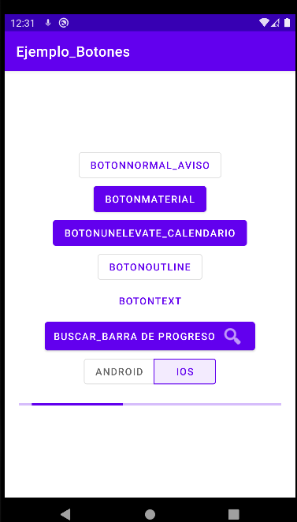

**BOTONES**


# Poner en el gradle
````
android {

  viewBinding {
  enabled = true
  }
}
````
# LAYOUTS
# **activity_main.xml**
````xml
<?xml version="1.0" encoding="utf-8"?>
<LinearLayout xmlns:android="http://schemas.android.com/apk/res/android"
    xmlns:app="http://schemas.android.com/apk/res-auto"
    xmlns:tools="http://schemas.android.com/tools"
    android:layout_width="match_parent"
    android:layout_height="match_parent"
    android:orientation="vertical"
    android:gravity="center"
    tools:context=".MainActivity">
    <Button
        android:layout_width="wrap_content"
        android:layout_height="wrap_content"
        android:text="BotonNormal_Aviso"
        style="@style/Widget.MaterialComponents.Button.OutlinedButton"
        android:id="@+id/boton0"/>
    <com.google.android.material.button.MaterialButton
        android:layout_width="wrap_content"
        android:layout_height="wrap_content"
        android:text="BotonMaterial"
        android:id="@+id/boton"
        style="@style/Widget.MaterialComponents.Button"/>
    <com.google.android.material.button.MaterialButton
        android:layout_width="wrap_content"
        android:layout_height="wrap_content"
        android:text="BotonUnelevate_Calendario"
        android:id="@+id/botonUnElevate"
        style="@style/Widget.MaterialComponents.Button.UnelevatedButton"/>
    <com.google.android.material.button.MaterialButton
        android:layout_width="wrap_content"
        android:layout_height="wrap_content"
        android:text="BotonOutline"
        android:id="@+id/botonUnOutline"
        style="@style/Widget.MaterialComponents.Button.OutlinedButton"/>
    <com.google.android.material.button.MaterialButton
        android:layout_width="wrap_content"
        android:layout_height="wrap_content"
        android:text="BotonText"
        android:onClick="miPulsacion"
        android:id="@+id/botonUnText"
        style="@style/Widget.MaterialComponents.Button.TextButton"/>
    <com.google.android.material.button.MaterialButton
        android:layout_width="wrap_content"
        android:layout_height="wrap_content"
        app:icon="@android:drawable/ic_menu_search"
        android:id="@+id/botonIcon"
        android:text="Buscar_Barra de progreso"
        app:iconGravity="end"
        style="@style/Widget.MaterialComponents.Button.Icon"/>

    <com.google.android.material.button.MaterialButtonToggleGroup
        android:layout_width="wrap_content"
        android:layout_height="wrap_content"
        app:checkedButton="@+id/btniOS"
        android:id="@+id/toggleGroup"
        app:singleSelection="true">
        <Button
            android:id="@+id/btnAndroid"
            style="@style/Widget.MaterialComponents.Button.OutlinedButton"
            android:layout_width="wrap_content"
            android:layout_height="wrap_content"
            android:text="Android" />
        <Button
            android:id="@+id/btniOS"
            style="@style/Widget.MaterialComponents.Button.OutlinedButton"
            android:layout_width="wrap_content"
            android:layout_height="wrap_content"
            android:text="iOS" />
    </com.google.android.material.button.MaterialButtonToggleGroup>


    <com.google.android.material.progressindicator.LinearProgressIndicator
        android:layout_width="match_parent"
        android:layout_height="wrap_content"
        android:layout_margin="20dp"
        android:indeterminate="true"
        android:id="@+id/progreso"/>

</LinearLayout>
````
--------------------------------------------------------------------------------
# **dialogo_personalizado.xml**

````xml
<?xml version="1.0" encoding="utf-8"?>
<LinearLayout xmlns:android="http://schemas.android.com/apk/res/android"
    android:layout_width="match_parent"
    android:background="@android:color/holo_orange_dark"
    android:layout_height="match_parent"
    android:id="@+id/padre"
    android:orientation="vertical">
    <LinearLayout
        android:layout_width="match_parent"
        android:layout_height="match_parent"
        android:orientation="horizontal">
    <TextView
        android:layout_width="wrap_content"
        android:layout_height="wrap_content"
        android:textSize="20dp"
        android:text="AVISO!!"
        />

        <ImageView
            android:layout_width="32dp"
            android:layout_height="wrap_content"
            android:layout_gravity="left"
            android:src="@android:drawable/ic_notification_overlay" />
    </LinearLayout>
    <Button
        android:layout_width="match_parent"
        android:layout_height="match_parent"
        android:text="Eliminar"
        android:id="@+id/eliminar"/>
</LinearLayout>
````
--------------------------------------------------------------------------------
# ACTIVITIES
# **MainActivity.kt**
````kotlin
package com.xusa.b3.botones

import androidx.appcompat.app.AppCompatActivity
import android.os.Bundle
import android.view.View
import android.widget.Button
import android.widget.Toast
import com.google.android.material.button.MaterialButtonToggleGroup
import com.google.android.material.datepicker.MaterialDatePicker
import com.google.android.material.dialog.MaterialAlertDialogBuilder
import com.google.android.material.progressindicator.LinearProgressIndicator
import com.xusa.b3.botones.databinding.ActivityMainBinding

import java.util.*

class MainActivity : AppCompatActivity(),View.OnClickListener, MaterialButtonToggleGroup.OnButtonCheckedListener{

    lateinit var bindig: ActivityMainBinding
    override fun onCreate(savedInstanceState: Bundle?) {
        super.onCreate(savedInstanceState)
        bindig= ActivityMainBinding.inflate(layoutInflater)
        setContentView(bindig.root)
        bindig.progreso.hide()
        bindig.boton.setOnClickListener{p->
            Toast.makeText(applicationContext,"Boton",Toast.LENGTH_LONG).show()
        }
        bindig.toggleGroup.addOnButtonCheckedListener{group, checkedId, isChecked ->
        }
        bindig.boton0.setOnClickListener(this)
        bindig.botonIcon.setOnClickListener(this)
        bindig.botonUnElevate.setOnClickListener(this)
    }

    override fun onClick(p0: View?) {
        when(p0)
        {
            bindig.boton0->   sacarDialog()
            bindig.botonIcon ->  sacarProgresIndicator()
            bindig.botonUnElevate->  sacarCalendario()
        }
    }

    fun sacarCalendario() {

        val calendar = Calendar.getInstance()
        calendar.set(1990,4,28)
        val datePicker = MaterialDatePicker.Builder.datePicker().build()
        datePicker.show(supportFragmentManager,"Calendario")
        datePicker.addOnPositiveButtonClickListener {
            Toast.makeText(applicationContext,datePicker.headerText,Toast.LENGTH_LONG).show()
        }
    }

    fun miPulsacion(v:View)
    {
        Toast.makeText(applicationContext,"´ñlfkjádslkfa´sñdflkñ´dsae",Toast.LENGTH_LONG).show()
    }

    fun sacarDialog()
    {
        val vista= layoutInflater.inflate(R.layout.dialogo_personalizado,null)
        var dialog= MaterialAlertDialogBuilder(this)
        dialog.setView(vista)
        dialog.show()
        vista.findViewById<Button>(R.id.eliminar).setOnClickListener{
            Toast.makeText(applicationContext,"Eliminado!!!",Toast.LENGTH_LONG).show()
        }
    }
    fun sacarProgresIndicator()
    {
        bindig.progreso.show()
    }
    override fun onButtonChecked(
        group: MaterialButtonToggleGroup?,
        checkedId: Int,
        isChecked: Boolean
    ) {
        TODO("Not yet implemented")
    }
}

````
# MANIFEST
# AndroidMainifest.xml
````kotlin
    <?xml version="1.0" encoding="utf-8"?>
    <manifest xmlns:android="http://schemas.android.com/apk/res/android"
        package="com.xusa.b3.botones">

        <application
            android:allowBackup="true"
            android:icon="@mipmap/ic_launcher"
            android:label="@string/app_name"
            android:roundIcon="@mipmap/ic_launcher_round"
            android:supportsRtl="true"
            android:theme="@style/Theme.Ejemplo_Botones">
            <activity
                android:name=".MainActivity"
                android:exported="true">
                <intent-filter>
                    <action android:name="android.intent.action.MAIN" />

                    <category android:name="android.intent.category.LAUNCHER" />
                </intent-filter>
            </activity>
        </application>
    </manifest>
````
