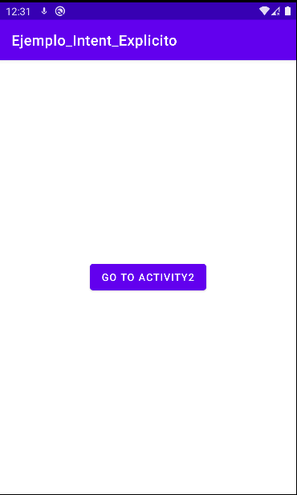
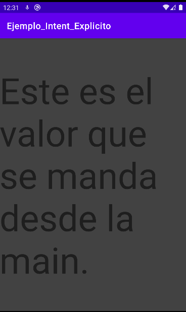

**IntentExplicito**




# LAYOUTS
# **activity_main.xml**
````xml
<?xml version="1.0" encoding="utf-8"?>
<androidx.constraintlayout.widget.ConstraintLayout
    xmlns:android="http://schemas.android.com/apk/res/android"
    xmlns:app="http://schemas.android.com/apk/res-auto"
    xmlns:tools="http://schemas.android.com/tools"
    android:layout_width="match_parent"
    android:layout_height="match_parent"
    tools:context=".MainActivity">

    <Button
        android:id="@+id/boton"
        android:layout_width="wrap_content"
        android:layout_height="wrap_content"
        android:text="Go to Activity2"
        app:layout_constraintBottom_toBottomOf="parent"
        app:layout_constraintLeft_toLeftOf="parent"
        app:layout_constraintRight_toRightOf="parent"
        app:layout_constraintTop_toTopOf="parent" />

</androidx.constraintlayout.widget.ConstraintLayout>
````
--------------------------------------------------------------------------------
# **activity2.xml**

````xml
<?xml version="1.0" encoding="utf-8"?>
<androidx.constraintlayout.widget.ConstraintLayout
    xmlns:android="http://schemas.android.com/apk/res/android"
    xmlns:app="http://schemas.android.com/apk/res-auto"
    xmlns:tools="http://schemas.android.com/tools"
    android:layout_width="match_parent"
    android:layout_height="match_parent"
    android:background="@color/cardview_dark_background"
    tools:context=".MainActivity">

    <TextView
        android:id="@+id/texto"
        android:layout_width="wrap_content"
        android:layout_height="wrap_content"
        android:text="Activity 2"
        android:textSize="80dp"
        app:layout_constraintBottom_toBottomOf="parent"
        app:layout_constraintLeft_toLeftOf="parent"
        app:layout_constraintRight_toRightOf="parent"
        app:layout_constraintTop_toTopOf="parent" />

</androidx.constraintlayout.widget.ConstraintLayout>
````
--------------------------------------------------------------------------------
# ACTIVITIES
# **MainActivity.kt**
````kotlin
package com.ejemplos.ejemplo_intent_explicito

import android.content.Intent
import androidx.appcompat.app.AppCompatActivity
import android.os.Bundle
import android.widget.Button

class MainActivity : AppCompatActivity() {
    override fun onCreate(savedInstanceState: Bundle?) {
        super.onCreate(savedInstanceState)
        setContentView(R.layout.activity_main)
        findViewById<Button>(R.id.boton).setOnClickListener()
        {
            val intento = Intent(applicationContext, Actividad2::class.java)
            intento.putExtra(
                "DATO", "Este es el valor que se manda desde la main."
            )
            startActivity(intento)
        }
    }
}
````
-------------------------------------------------------------------------------
# Actividad2.kt
````kotlin
package com.ejemplos.ejemplo_intent_explicito

import android.os.Bundle
import android.os.PersistableBundle
import android.widget.TextView
import androidx.appcompat.app.AppCompatActivity

class Actividad2 : AppCompatActivity() {
    override fun onCreate(savedInstanceState: Bundle?) {
        super.onCreate(savedInstanceState)
        setContentView(R.layout.activity2)

        var intento = intent
        findViewById<TextView>(R.id.texto).setText(intento.getStringExtra("DATO"))
    }
}
````
--------------------------------------------------------------------------------

# MANIFEST
# AndroidMainifest.xml
````kotlin
<?xml version="1.0" encoding="utf-8"?>
<manifest xmlns:android="http://schemas.android.com/apk/res/android"
    package="com.ejemplos.ejemplo_intent_explicito">

    <application
        android:allowBackup="true"
        android:icon="@mipmap/ic_launcher"
        android:label="@string/app_name"
        android:roundIcon="@mipmap/ic_launcher_round"
        android:supportsRtl="true"
        android:theme="@style/Theme.Ejemplo_Intent_Explicito">
        <activity
            android:name=".MainActivity"
            android:exported="true">
            <intent-filter>
                <action android:name="android.intent.action.MAIN" />

                <category android:name="android.intent.category.LAUNCHER" />
            </intent-filter>
        </activity>

        <activity android:name=".Actividad2"/>

    </application>
</manifest>
````
