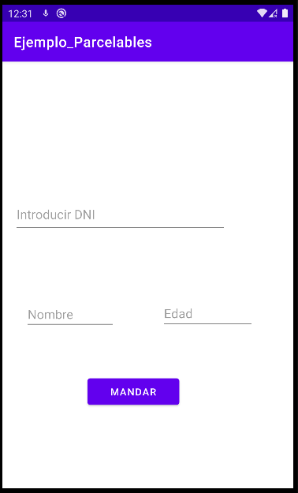
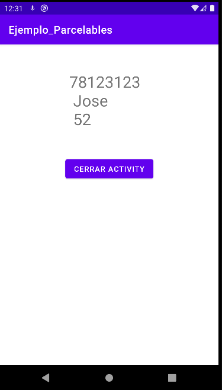

**Parcelable**




# LAYOUTS
# **activity_main.xml**
````xml
<?xml version="1.0" encoding="utf-8"?>
<androidx.constraintlayout.widget.ConstraintLayout
    xmlns:android="http://schemas.android.com/apk/res/android"
    xmlns:app="http://schemas.android.com/apk/res-auto"
    xmlns:tools="http://schemas.android.com/tools"
    android:layout_width="match_parent"
    android:layout_height="match_parent"
    tools:context=".MainActivity">


    <EditText
        android:id="@+id/DniTexto"
        android:layout_width="301dp"
        android:layout_height="53dp"
        android:layout_marginStart="16dp"
        android:layout_marginTop="190dp"
        android:layout_marginEnd="94dp"
        android:layout_marginBottom="49dp"
        android:ems="10"
        android:hint="Introducir DNI"
        android:inputType="textPersonName"
        app:layout_constraintBottom_toTopOf="@+id/NombreTexto"
        app:layout_constraintEnd_toEndOf="parent"
        app:layout_constraintStart_toStartOf="parent"
        app:layout_constraintTop_toTopOf="parent" />

    <EditText
        android:id="@+id/NombreTexto"
        android:layout_width="128dp"
        android:layout_height="39dp"
        android:layout_marginStart="16dp"
        android:layout_marginTop="49dp"
        android:layout_marginEnd="49dp"
        android:layout_marginBottom="62dp"
        android:ems="10"
        android:hint="Nombre"
        android:inputType="textPersonName"
        app:layout_constraintBottom_toTopOf="@+id/BotonMandar"
        app:layout_constraintEnd_toStartOf="@+id/EdadTexto"
        app:layout_constraintStart_toStartOf="parent"
        app:layout_constraintTop_toBottomOf="@+id/DniTexto" />

    <EditText
        android:id="@+id/EdadTexto"
        android:layout_width="131dp"
        android:layout_height="45dp"
        android:layout_marginStart="219dp"
        android:layout_marginTop="102dp"
        android:layout_marginEnd="50dp"
        android:layout_marginBottom="1dp"
        android:ems="10"
        android:hint="Edad"
        android:inputType="number"
        app:layout_constraintBottom_toTopOf="@+id/BotonMandar"
        app:layout_constraintEnd_toEndOf="parent"
        app:layout_constraintStart_toStartOf="parent"
        app:layout_constraintTop_toBottomOf="@+id/DniTexto" />

    <Button
        android:id="@+id/BotonMandar"
        android:layout_width="130dp"
        android:layout_height="49dp"
        android:layout_marginStart="120dp"
        android:layout_marginTop="62dp"
        android:layout_marginEnd="161dp"
        android:layout_marginBottom="240dp"
        android:text="Mandar"
        app:layout_constraintBottom_toBottomOf="parent"
        app:layout_constraintEnd_toEndOf="parent"
        app:layout_constraintStart_toStartOf="parent"
        app:layout_constraintTop_toBottomOf="@+id/EdadTexto" />

</androidx.constraintlayout.widget.ConstraintLayout>
````
--------------------------------------------------------------------------------
# **activity_parcelable2.xml**

````xml
<?xml version="1.0" encoding="utf-8"?>
<androidx.constraintlayout.widget.ConstraintLayout
    xmlns:android="http://schemas.android.com/apk/res/android"
    xmlns:app="http://schemas.android.com/apk/res-auto"
    xmlns:tools="http://schemas.android.com/tools"
    android:layout_width="match_parent"
    android:layout_height="match_parent"
    tools:context=".Parcelable2Activity">

    <TextView
        android:id="@+id/dnitextView"
        android:layout_width="wrap_content"
        android:layout_height="wrap_content"
        android:layout_marginTop="50dp"
        android:text="TextView"
        android:textSize="30dp"
        app:layout_constraintEnd_toEndOf="parent"
        app:layout_constraintStart_toStartOf="parent"
        app:layout_constraintTop_toTopOf="parent" />

    <Button
        android:id="@+id/cerrarButton"
        android:layout_width="wrap_content"
        android:layout_height="wrap_content"
        android:layout_marginTop="50dp"
        android:text="Cerrar Activity"

        app:layout_constraintEnd_toEndOf="parent"
        app:layout_constraintStart_toStartOf="parent"
        app:layout_constraintTop_toBottomOf="@+id/dnitextView" />

</androidx.constraintlayout.widget.ConstraintLayout>
````
--------------------------------------------------------------------------------
# ACTIVITIES
# **MainActivity.kt**
````kotlin
package com.ismadev.b2.ejercicioparcelables

import android.content.Intent
import androidx.appcompat.app.AppCompatActivity
import android.os.Bundle
import android.widget.Button
import android.widget.EditText

class MainActivity : AppCompatActivity() {
    override fun onCreate(savedInstanceState: Bundle?) {
        super.onCreate(savedInstanceState)
        setContentView(R.layout.activity_main)

        findViewById<Button>(R.id.BotonMandar).setOnClickListener {
            val dni:String = findViewById<EditText>(R.id.DniTexto).text.toString()
            val nombre:String = findViewById<EditText>(R.id.NombreTexto).text.toString()
            val edad:Int = findViewById<EditText>(R.id.EdadTexto).text.toString().toInt()

            val intento = Intent(applicationContext, Parcelable2Activity::class.java)
            intento.putExtra("DATOS", Persona(dni,nombre,edad))
            startActivity(intento)

        }
    }
}
````
-------------------------------------------------------------------------------
# Parcelable2Activity.kt
````kotlin
package com.ismadev.b2.ejercicioparcelables

import android.content.Intent
import androidx.appcompat.app.AppCompatActivity
import android.os.Bundle
import android.widget.Button
import android.widget.EditText

class MainActivity : AppCompatActivity() {
    override fun onCreate(savedInstanceState: Bundle?) {
        super.onCreate(savedInstanceState)
        setContentView(R.layout.activity_main)

        findViewById<Button>(R.id.BotonMandar).setOnClickListener {
            val dni:String = findViewById<EditText>(R.id.DniTexto).text.toString()
            val nombre:String = findViewById<EditText>(R.id.NombreTexto).text.toString()
            val edad:Int = findViewById<EditText>(R.id.EdadTexto).text.toString().toInt()

            val intento = Intent(applicationContext, Parcelable2Activity::class.java)
            intento.putExtra("DATOS", Persona(dni,nombre,edad))
            startActivity(intento)
        }
    }
}
````
--------------------------------------------------------------------------------
# Persona.kt
````kotlin
package com.ismadev.b2.ejercicioparcelables

import android.os.Parcel
import android.os.Parcelable

class Persona() : Parcelable {
    var dni: String
    var nombre: String
    var edad: Int

    constructor(parcel: Parcel) : this() {
        dni = parcel.readString().toString()
        nombre = parcel.readString().toString()
        edad = parcel.readInt()
    }

    init {
        dni = ""
        nombre = ""
        edad = 0
    }

    constructor(dni: String, nombre: String, edad: Int) : this() {
        this.dni = dni
        this.nombre = nombre
        this.edad = edad
    }

    override fun toString(): String {
        return "$dni \n $nombre \n $edad"
    }


    override fun writeToParcel(parcel: Parcel, flags: Int) {
        parcel.writeString(dni)
        parcel.writeString(nombre)
        parcel.writeInt(edad)
    }

    override fun describeContents(): Int {
        return 0
    }

    companion object CREATOR : Parcelable.Creator<Persona> {
        override fun createFromParcel(parcel: Parcel): Persona {
            return Persona(parcel)
        }

        override fun newArray(size: Int): Array<Persona?> {
            return arrayOfNulls(size)
        }
    }
}
````
# MANIFEST
# AndroidMainifest.xml
````kotlin
  <?xml version="1.0" encoding="utf-8"?>
<manifest xmlns:android="http://schemas.android.com/apk/res/android"
    package="com.ismadev.b2.ejercicioparcelables">

    <application
        android:allowBackup="true"
        android:icon="@mipmap/ic_launcher"
        android:label="@string/app_name"
        android:roundIcon="@mipmap/ic_launcher_round"
        android:supportsRtl="true"
        android:theme="@style/Theme.Ejemplo_Parcelables">
        <activity
            android:name=".Parcelable2Activity"
            android:exported="true" />
        <activity
            android:name=".MainActivity"
            android:exported="true">
            <intent-filter>
                <action android:name="android.intent.action.MAIN" />

                <category android:name="android.intent.category.LAUNCHER" />
            </intent-filter>
        </activity>
    </application>

</manifest>
````
