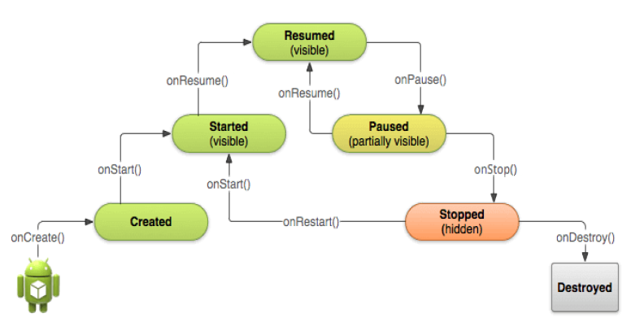
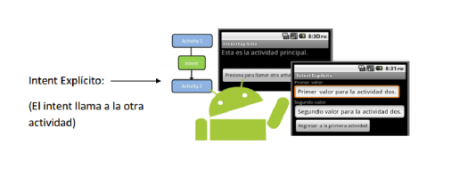
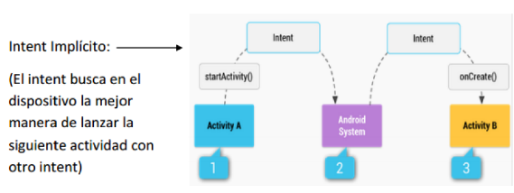

# T3 - Componentes de una aplicación Android

- El contexto es una interfaz entre la aplicación y el OS, que describe información que representa la aplicación .
- Permite acceder a los recursos de la aplicación y coordinar el funcionamiento de los bloques de la app.
- Lo implementamos a tráves de lac aclase abstracta ``Context``.
- En Android hay dos tipos de contextos:
   - **Aplicación** - Engloba a todos los demás.
   - Cubre todo el ciclo de vida de la app desde que se inicia hasta que muere.
   - Cada app tiene un contexto único de app.
   - Accesible desde desde una Activity o Service con ``application`` o cualquiera que herede Context con ``applicationContext``.
   - **Activity o Service**
   - El context pertenece al ciclo de vida, un context de una activity vive el mismo tiempo que vive la activity y vivirá menos que el de la aplicación.

## Componentes de una aplicación

### Activity
- Componentes visibles de aplicación, con una interfaz para interactuar con ellas.
- Se permite la ejecución de varias acciones mediante una o más pantallas.
- **Ejemplo** aplicación de contactos en una pantalla, otra para mandar mensajes y otra para el historial.

### Services
- Entidad que ejecuta instrucciones en segundo plano sin que lo note el usuario.
- Muy usados en acciones de larga duración.
- Los servicios también tienen un ciclo de vida, pero más corto (Creación, Ejecución y Destrución).

### View


### Fragment

### Widget

### Content provider

### Intens

### Broadcast receiver

## Ciclo de vida de una Activity

  

- Los estados por los que pasa una activity son:
  * Creación -> onCreate() se ejecuta para cargar el layout de la actividad principal.
  * Ejecución-Reanudación -> onStart() y onResume(), la primera hace visible la actividad y la otra permite el usuario interactúe con ella.
  * Detención ->
  * Destrución ->

## Comunicación de Activitys a través de Intents

### Intent explícito

  
- Se usa cuando se quiere ejecutar los componentes internos de una aplicación.


- Para el inicio de una nueva actividad se pueden dar varias circunstancias:
### Inicio de una actividad sin argumentos ni devolución de resultados:

````kotlin
  var intento= Intent(this, Activity2::class.java)
  //var intento=Intent(applicationContext, Activity2::class.java)
  startActivity(intento)
````
--------------------------------------------------------------------------------
### Inicio de una actividad con argumentos y sin devolución de resultados

````kotlin
var intento= Intent(applicationContext, Activity2::class.java)
intento.putExtra("DATO", "Este es el valor que se manda desde Main Activity")
startActivity(intento)
````
--------------------------------------------------------------------------------

- En la clase invocada obtendremos los datos recibidos de la siguiente manera:

````kotlin
var intento=intent
findViewById<TextView>(R.id.textoActivity2).setText(intento.getStringExtra("DATO"))
````
--------------------------------------------------------------------------------

````kotlin
class MainActivity:AppCompatActivity(){
    override fun onCreate(savedInstanceState: Bundle?) {
        super.onCreate(savedInstanceState)
        setContentView(R.layout.activity_main)
        val openPostActivity =
            registerForActivityResult(ActivityResultContracts.StartActivityForResult())
            {
                    result -> if (result.resultCode == Activity.RESULT_OK) {
                Toast.makeText(applicationContext,result.data?.
                getStringExtra("DATORETURN"),Toast.LENGTH_SHORT).show()
            }
            }
        findViewById<TextView>(R.id.textoActivity1).setOnClickListener(
            View.OnClickListener{
                openPostActivity.launch(
                    Intent(applicationContext, Activity2::class.java).apply
                    {putExtra("DATO", "Este es el valor que se manda desde Main Activity")})
            })
    }
}
````

````kotlin
textView.setOnClickListener {
    val intentoResultado = Intent()
    intentoResultado.putExtra("DATORETURN", "Este es el dato")
    setResult(Activity.RESULT_OK, intentoResultado)
    //Finaliza el intent
    finish()
}
````

--------------------------------------------------------------------------------
### Intent Implícito



- Aquellos que le preguntan al sistema qué servicio o componente es el más adecuado para realizar la petición.
- No específica un componente en especial, y solo se especifica la funcionalidad requerida a través de una acción (ver, hacer búsqueda, hacer foto, marcar número…).
- Y un dato (URL, número a marcar…)
- los pasos para lanzar una actividad con un intent implícito
  * Declaramos el intent con la acción apropiada (ACTION_VIEW, ACTION_WEB_SEARCH, etc).
  * Adjuntamos información adicional necesaria dependiendo de la acción del intent.
  * Lanzamos el intent dejando que el sistema encuentre la actividad adecuada).

  

### Para mostrar una web dentro de un navegador:

````kotlin
Intent intento = new Intent(Intent.ACTION_VIEW, Uri.parse("http://www.google.es"));
startActivity(intento);
````
- Requiere los permisos en **manifest.xml**:
````xml
<uses-permission android:name="android.permission.INTERNET"/>
````
-----------------------------------------------------------------------------------------------------

## Para utilizar la búsqueda de google;
````kotlin
Intent intento = new Intent(Intent.ACTION_WEB_SEARCH);
intento.putExtra(SearchManager.QUERY, "I.E.S. Doctor Balmis");
startActivity(intento);
````
- Requiere los permisos en **manifest.xml**:
````xml
<uses-permission android:name="android.permission.INTERNET"/>
````
--------------------------------------------------------------------------------
### Para mostrar los contactos.
````kotlin
Intent intento = new Intent(Intent.ACTION_VIEW, Uri.parse("content://contacts/people/"));
startActivity(intento);
````
- Requiere los permisos en **manifest.xml**:
````xml
<uses-permission android:name="android.permission.READ_CONTACTS"/>
````
--------------------------------------------------------------------------------


````kotlin
Intent intento = new Intent(Intent.ACTION_VIEW, Uri.parse("content://contacts/people/"));
if (intento.resolveActivity(packageManager) != null) startActivity(intento);
````

## Requerir permisos al usuario
````Kotlin
val RESPUESTA_PERMISOS = 111

@RequiresApi(Build.VERSION_CODES.Q)
fun solicitarPermisos() {
    if (checkSelfPermission(READ_EXTERNAL_STORAGE) == PackageManager.PERMISSION_DENIED
        || checkSelfPermission(READ_CONTACTS) == PackageManager.PERMISSION_DENIED
    ) {
        if (shouldShowRequestPermissionRationale(READ_EXTERNAL_STORAGE))
//Si se decide explicar los motivos de los permisos con similar a un dialogo
            if (shouldShowRequestPermissionRationale(READ_CONTACTS))
//Si se decide explicar los motivos de los permisos con similar a un dialogo
//Con requestPermissions se pide al usuario que permita los permisos,
//en este caso dos
                requestPermissions(arrayOf(READ_EXTERNAL_STORAGE, _CONTACTS), RESPUESTA_PERMISOS)
    } else lanzarFuncionalidadQueRequierePermisos()
}

override fun onRequestPermissionsResult(
    requestCode: Int,//código de identificación del resultado
    permissions: Array<out String>,//array con los nombres de los permisos
    grantResults: IntArray//array de 0 y -1 (permitido, no permitido) en orden)
{
    super.onRequestPermissionsResult(requestCode, permissions, grantResults)
    when (requestCode) {
        RESPUESTA_PERMISOS -> {
            if (grantResults[0] == PackageManager.PERMISSION_GRANTED)
                Toast.makeText(
                    applicationContext,
                    permissions[0] + " Permiso concedido",
                    Toast.LENGTH_SHORT
                ).show()
            if (grantResults[1] == PackageManager.PERMISSION_GRANTED)
                Toast.makeText(
                    applicationContext,
                    permissions[1] + " Permiso concedido",
                    Toast.LENGTH_SHORT
                ).show()
        }
    }
}
````
- Se debe de añadir su etiqueta de permisos y correspondiente filter en el ``Manifest.xml``
````xml
   <uses-permission android:name="android.permission.READ_EXTERNAL_STORAGE" />
   <uses-permission android:name="android.permission.READ_CONTACTS" />
````


## Intent-filter

- Los intent-filter se definen en el archivo de manifiesto de la aplicación dentro de la activity correspondiente.
- Cuando se realiza un intent implícito el sistema busca el componente adecuado, analizando los filter
  * Si existe lanza la aplicación y si hay varias deja elegir al usuario.
- A un Intent podemos asociarle una **acción**, una **categoría** yunos **datos**.
  * Las **acciones** son cadenas de texto estándar que describen lo que la actividad puede hacer.
  * Una **categoría**, indica si la actividad va a ser lanzada desde el lanzador de aplicaciones, desde el menú de otra aplicación o directamente desde otra actividad.
  * La misma actividad puede declarar el **tipo de datos** del que se ocupa.

**Manifest.xml**
````xml
<intent-filter>
    <!--Indica que la actividad puede mostrar datos al usuario-->
    <action android:name="android.intent.action.VIEW"/>
    <!--Va a ser lanzada desde el lanzador de aplicaciones-->
    <category android:name="android.intent.category.DEFAULT"/>
    <!--La actividad manipula los datos de la agenda-->
    <data android:mimeType="vnd.android.cursor.dir/person"/>
</intent-filter>
````
- Una activity puede tener varios intent-filter definidos. Igualmente cada uno de esos ``intent-filter`` puede tener varias acciones definidas.

**Ejemplo**

````xml
<activity class = ".NotesList" android:label = "@string/title_notes_list">
  <!--Esta activity es punto de entrada para la aplicación.
  La categoría especifica que debe aparecer en el lanzador de aplicaciones-->
  <intent-filter>

      <action android:name="android.intent.action.VIEW"/>

      <category android:name="android.intent.category.DEFAULT"/>

      <data android:mimeType="vnd.android.cursor.dir/person"/>
  </intent-filter>
  <!--permite a
  la activity visualizar y editar el directorio de datos (a través de las actions VIEW y EDIT),
  o recuperar una entrada particular y devolverla (a través de la action PICK).
  En data se especifica el tipo de datos que se manejan.
  Como está definido con la Categoría DEFAULT, estamos indicando que atenderá a los intents
  implícitos que soliciten otras aplicaciones.-->
  <intent-filter>

      <action android:name="android.intent.action.VIEW"/>

      <category android:name="android.intent.category.DEFAULT"/>

      <data android:mimeType="vnd.android.cursor.dir/person"/>
  </intent-filter>
  <!--Indica que la actividad puede mostrar datos al usuario-->
  <intent-filter>

      <action android:name="android.intent.action.VIEW"/>

      <category android:name="android.intent.category.DEFAULT"/>

      <data android:mimeType="vnd.android.cursor.dir/person"/>
  </intent-filter>
</activity>  
````

## Trabajando con Parcelables

Clase ``Contacto`` que hereda de la Interfaz Parcelable :

````kotlin
class Contacto() : Parcelable {
    var nombre: String?
    var telefono: String?
    var email: String?
    var foto: Bitmap?
    //Constructor generado automáticamente
    constructor(parcel: Parcel) : this() {
        nombre = parcel.readString()
        telefono = parcel.readString()
        email = parcel.readString()
        foto = parcel.readParcelable(Bitmap::class.java.classLoader)
    }
    init{
        this.nombre=""
        this.telefono=""
        this.email=""
        this.foto=null
    }
    constructor(nombre: String?, telefono: String?,
                email: String?, foto: Bitmap?):this(){
        this.nombre = nombre
        this.telefono = telefono
        this.email = email
        this.foto = foto
    }
    //funciones generadas automáticamente
    override fun describeContents(): Int {
        return 0
    }
    override fun writeToParcel(parcel: Parcel, flags: Int) {
        parcel.writeString(nombre)
        parcel.writeString(telefono)
        parcel.writeString(email)
        parcel.writeParcelable(foto, flags)
    }
    //Clase creada automáticamente. Un companion object es la forma que tienen Kotlin
    //de definir miembros staticos dentro de una clase, todos los elementos
    //de este object serán static
    companion object CREATOR : Creator<Contacto> {
        override fun createFromParcel(parcel: Parcel): Contacto {
            return Contacto(parcel)
        }
        override fun newArray(size: Int): Array<Contacto?> {
            return arrayOfNulls(size)
        }
    }
}
````
- Clase ``MainActivity`` que inicia la actividad segunda mandando el objeto parcelado.

````kotlin
class MainActivity : AppCompatActivity()
{
    override fun onCreate(savedInstanceState: Bundle?) {
        super.onCreate(savedInstanceState)
        setContentView(R.layout.activity_main)
        val nombre = findViewById<TextView>(R.id.campo_nombre)
        val tlf = findViewById<TextView>(R.id.campo_tlf)
        val correo = findViewById<TextView>(R.id.campo_correo)
        val img = findViewById<ImageButton>(R.id.placeImage)
        val imagen = BitmapFactory.decodeResource(resources, R.drawable.noimagen)
        val button: Button = findViewById<Button>(R.id.boton)
        button.setOnClickListener {
            val c = Contacto(nombre.text.toString(), tlf.text.toString(),
                correo.text.toString(), imagen)
            val intent = Intent(applicationContext, Activity2::class.java)
            intent.putExtra("CONTACTO", c)
            startActivity(intent)}
    }
}
````
- En la ``Activity2`` recuperaremos el objeto pasado, con la línea 6.

````kotlin
class Activity2 : AppCompatActivity() {
    override fun onCreate(savedInstanceState: Bundle?) {
        super.onCreate(savedInstanceState);
        setContentView(R.layout.activity2);
//recuperar datos y visualizar
        val c = this.intent.getParcelableExtra<Contacto>("CONTACTO");
        val nombre = findViewById<TextView>(R.id.txt_nombre);
        val tlf = findViewById<TextView>(R.id.txt_tlf);
        val correo = findViewById<TextView>(R.id.txt_correo);
        val img = findViewById<ImageButton>(R.id.placeImage);
        if (c != null) {
            nombre.setText(c.nombre)
            tlf.setText(c.telefono)
            correo.setText(c.email)
            img.setImageBitmap(c.foto)
        }
    }
}
````
- No olvides declarar en el ``Manifest`` las dos actividades.
